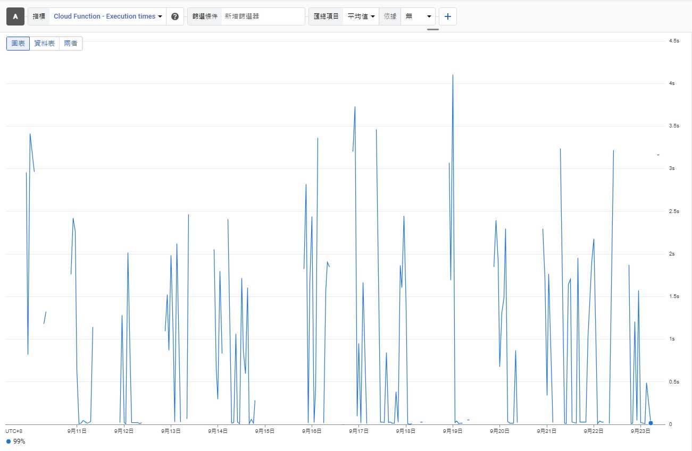
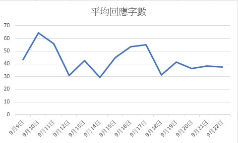

# Line客服機器人串接GPT-4o模型

將OpenAI的GPT-4o模型利用python串接LINE自動回覆機器人，透過串接OpenAI GPT-4o模型使回復更精確及人性化。

## 程式說明

網上有許多串接GPT-3.5模型的Line自動回覆機器人，有鑒於目前最新有釋出API的模型是GPT-4o，於是我將模型換成GPT-4o。對話紀錄存至firebase，之後有遇到類似問題時會去翻對話紀錄參考。針對某些問題需要特別的回應的部分，我的方法是將特定回應在建立新聊天室的時候新增進去，使用者在任何情況下都能得到預期的回應。
在實作的過程有發現資料庫超過五百則回覆execute time會開始增加，甚至會發生已讀不回的問題，故我還有寫一個機制，在24小時後使用者沒傳訊息就會自動清空，防止資料庫過大影響execute time。

## 實測效果

1. **Execute Time**  
   平均execute time約為3.2秒，最高execute time約為4.2秒，都能穩定的在5秒內回答完畢。
   

2. **平均回應字數**  
   約略在30~70字之間，我有預先告訴模型回答簡明扼要，而結果也如預期簡單明瞭，如此可以省成本(因為API計費是用token計費)，也能方便使用者閱讀。  
   

3. **回答正確性**  
   首次測試50題，答對(指得到我們想要的答案)率高達98%，相較GPT-3.5準確率78%高出20%!
